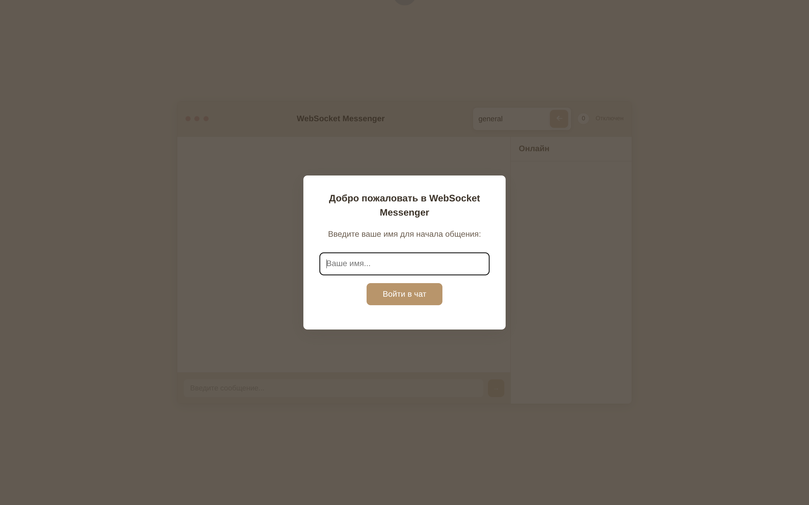

<div align="center">

# WebSocketMassenger

A lightweight, fast WebSocket chat server in C++17 (Boost.Beast) with a modern HTML/CSS/JS client.


[Русская версия](README.md)

</div>

---

## Features

- Real‑time WebSocket chat (broadcast + user list)
- Token‑based authentication with unique username check
- Detailed logging into `server.log`
- Ping/Pong to keep the connection alive and show status
- Static web assets are copied near the binary after build

Honest notes based on sources:
- C++ standard is C++17 (see `CMakeLists.txt`).
- OpenSSL is linked but TLS is not implemented in server code (no TLS handshake layer). The `certs/` folder may be used in the future.
- There is no HTTP server in the code: the web client is static files opened directly (or from any static server) and connects to WebSocket using `src/web/js/config.js`.

## Quick start

1) Make sure you have CMake 3.16+, a C++17 compiler, and Git installed.

2) Install dependencies via vcpkg (the repo already includes `vcpkg/`):

```
vcpkg install boost-beast:x64-windows
vcpkg install boost-system:x64-windows
vcpkg install boost-thread:x64-windows
vcpkg install openssl:x64-windows
vcpkg install nlohmann-json:x64-windows
```

3) Build (Windows or Linux) using the vcpkg toolchain:

```
mkdir build && cd build
cmake .. -DCMAKE_TOOLCHAIN_FILE=../vcpkg/scripts/buildsystems/vcpkg.cmake -DCMAKE_BUILD_TYPE=Release
cmake --build . --config Release
```

After building, you will find `WebSocketServer(.exe)` in `build/` and the `web/` folder copied next to it (post‑build step).

## Build details

- Minimum CMake: 3.16
- Language: C++17
- Packages (via `find_package`): Boost (system, thread), OpenSSL, nlohmann_json
- Extra Windows libs: `ws2_32`, `mswsock`, `crypt32`

`CMakeLists.txt` builds `WebSocketServer` from `src/server/main.cpp` and copies `src/web/` → `build/web/` and `certs/` → `build/certs/` if present.

## Run

Server expects 3 CLI args (see `main.cpp`):

```
Usage: websocket-server-async <address> <port> <threads>
Example:
        websocket-server-async 0.0.0.0 8080 1
```

Examples:

- Windows (PowerShell): `./build/WebSocketServer.exe 0.0.0.0 8081 1`
- Linux: `./build/WebSocketServer 0.0.0.0 8081 1`

By default, the web client targets `ws://localhost:8081` (see `src/web/js/config.js`). Adjust `WS_URL` as needed.

### Web client

- Open `src/web/index.html` in your browser (or serve `build/web/` from any static server).
- Enter a username (up to 20 chars). The client will send the token and username.

## Screenshots




## Protocol

All messages are JSON over WebSocket. Main types:

- auth
  - request: `{ "type": "auth", "token": "Bearer mytoken", "username": "Alice" }`
  - success: `{ "type": "auth", "message": "AUTH_RESPONSE" }`
  - failure: `{ "type": "auth_error", "message": "..." }` (connection may be closed)

- user_list (server → client)
  - `{ "type": "user_list", "users": ["Alice", "Bob", ...] }`

- user_joined / user_left (server notifies others)
  - `{ "type": "user_joined", "username": "Alice" }`
  - `{ "type": "user_left", "username": "Alice" }`

- message (server relays to chat)
  - `{ "type": "message", "data": "text", "from": "Alice", "sender_id": 1, "timestamp": "YYYY-MM-DD HH:MM:SS.mmm" }`

- broadcast (client → server)
  - request: `{ "type": "broadcast", "message": "text", "timestamp": "..." }`
  - to others: `{ "type": "broadcast", "from": "Alice", "message": "text", "timestamp": "..." }`

- ping / pong
  - client sends `{ "type": "ping" }`, server replies `{ "type": "pong", "timestamp": "..." }`

- error
  - `{ "type": "error", "message": "Unknown message type: ..." }`

Auth rules:
- Exact token required: `Bearer mytoken` (`session::valid_token_`).
- Username must be non‑empty and unique among active sessions.

## Logs

The server writes detailed logs to `server.log` (process working directory, typically `build/server.log`): startup/shutdown, connections, IN/OUT messages, warnings, and Boost error codes.

## Project structure

```
WebSocketMassenger/
├── CMakeLists.txt            # CMake: C++17, Boost, OpenSSL, nlohmann_json
├── packages.txt              # vcpkg install hints
├── src/
│   ├── server/
│   │   └── main.cpp         # WebSocket server logic (Boost.Beast/Asio)
│   └── web/
│       ├── index.html       # Client UI
│       ├── css/style.css    # Modern minimal style
│       └── js/
│           ├── config.js    # WS_URL, AUTH_TOKEN, intervals
│           └── messenger.js # Client logic: auth, ping, user list, etc.
├── certs/                    # (empty) reserved for TLS certs
└── build/                    # Build artifacts, binary, and copied web/
```

## Screenshots

Store images in `docs/images/` and reference them from README via relative paths. Example: add `docs/images/chat.png` and place in README:

```

```

Tips:
- Use reasonable resolution (width ~1200–1600px), PNG or WebP.
- Provide descriptive alt text.
- For both dark/light variants, save as `chat-light.png` and `chat-dark.png` and include both.

---

If you find this project useful, consider starring and sharing it.
