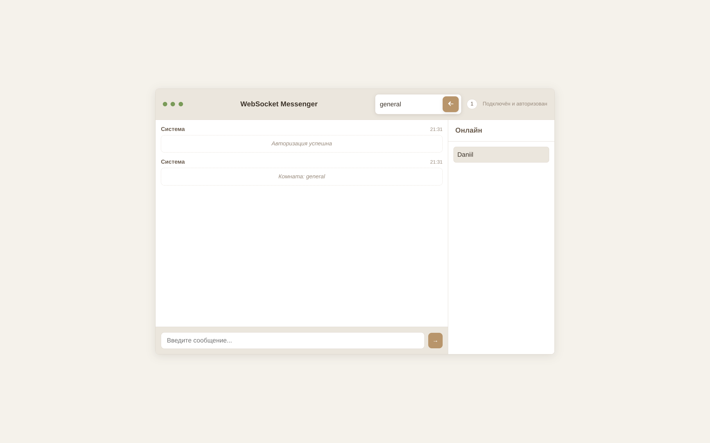

<div align="center">

# WebSocketMassenger

Лёгкий и быстрый WebSocket‑чат на C++17 (Boost.Beast) с современным веб‑клиентом (HTML/CSS/JS).


[English version](README.en.md)

[Особенности](#особенности) • [Быстрый старт](#быстрый-старт) • [Сборка](#сборка) • [Запуск](#запуск) • [Протокол](#протокол) • [Структура](#структура-проекта) • [FAQ](#faq)

</div>

---

## Особенности

- Реальный чат по WebSocket (broadcast + список пользователей)
- Аутентификация через токен и уникальное имя пользователя
- Подробное логирование в файл `server.log`
- Пинг/понг для поддержания соединения и индикации живости
- Готовые статические web‑ресурсы копируются рядом с бинарником

Что важно знать:
- Стандарт C++ — C++17 (см. `CMakeLists.txt`).
- OpenSSL линкуется, но TLS в текущем сервере не используется (нет кода TLS‑handshake).
- HTTP‑сервера нет: веб‑клиент — статические файлы, которые открываются напрямую (или из любого статик‑сервера) и подключаются к WebSocket по адресу из `src/web/js/config.js`.

## Быстрый старт

1) Убедитесь, что установлены: CMake 3.16+, компилятор C++17, Git.

2) Установите зависимости через vcpkg (в репозитории уже есть папка `vcpkg/`):

```
vcpkg install boost-beast:x64-windows
vcpkg install boost-system:x64-windows
vcpkg install boost-thread:x64-windows
vcpkg install openssl:x64-windows
vcpkg install nlohmann-json:x64-windows
```

3) Сборка (Windows или Linux) с использованием toolchain vcpkg:

```
mkdir build && cd build
cmake .. -DCMAKE_TOOLCHAIN_FILE=../vcpkg/scripts/buildsystems/vcpkg.cmake -DCMAKE_BUILD_TYPE=Release
cmake --build . --config Release
```

После сборки в каталоге `build/` появится бинарник `WebSocketServer(.exe)` и рядом папка `web/` со статикой (копируется пост‑сборкой).

## Сборка

- Минимальная версия CMake: 3.16
- Язык: C++17
- Пакеты (через `find_package`): Boost (system, thread), OpenSSL, nlohmann_json
- Доп. системные библиотеки на Windows: `ws2_32`, `mswsock`, `crypt32`

Файл `CMakeLists.txt` создаёт исполняемый файл `WebSocketServer` из `src/server/main.cpp` и на этапе post‑build копирует `src/web/` → `build/web/` и `certs/` → `build/certs/` (если существуют).

## Запуск

Сервер принимает 3 аргумента командной строки (см. `main.cpp`):

```
Usage: websocket-server-async <address> <port> <threads>
Example:
        websocket-server-async 0.0.0.0 8080 1
```

Примеры запуска:

- Windows (PowerShell): `.\build\WebSocketServer.exe 0.0.0.0 8081 1`
- Linux: `./build/WebSocketServer 0.0.0.0 8081 1`

По умолчанию веб‑клиент настроен на `ws://localhost:8081` (см. `src/web/js/config.js`). При желании измените `WS_URL` под ваш порт/хост.

### Веб‑клиент

- Откройте файл `src/web/index.html` в браузере (либо используйте любой статический веб‑сервер, указывающий на папку `build/web/`).
- В модальном окне введите имя (до 20 символов). Клиент отправит токен и имя на сервер.

## Скриншоты




## Протокол

Все сообщения — JSON по WebSocket. Основные типы:

- auth
    - запрос: `{ "type": "auth", "token": "Bearer mytoken", "username": "Alice" }`
    - ответ при успехе: `{ "type": "auth", "message": "AUTH_RESPONSE" }`
    - при ошибке: `{ "type": "auth_error", "message": "..." }` и соединение может закрываться

- user_list (сервер → клиент)
    - `{ "type": "user_list", "users": ["Alice", "Bob", ...] }`

- user_joined / user_left (сервер информирует остальных)
    - `{ "type": "user_joined", "username": "Alice" }`
    - `{ "type": "user_left", "username": "Alice" }`

- message (сервер ретранслирует сообщение в общий чат)
    - `{ "type": "message", "data": "text", "from": "Alice", "sender_id": 1, "timestamp": "YYYY-MM-DD HH:MM:SS.mmm" }`

- broadcast (клиент → сервер для общей рассылки)
    - запрос клиента: `{ "type": "broadcast", "message": "text", "timestamp": "..." }`
    - рассылка остальным: `{ "type": "broadcast", "from": "Alice", "message": "text", "timestamp": "..." }`

- ping / pong
    - клиент отправляет `{ "type": "ping" }`, сервер отвечает `{ "type": "pong", "timestamp": "..." }`

- error (общий формат ошибок)
    - `{ "type": "error", "message": "Unknown message type: ..." }`

Правила аутентификации:
- Требуется точный токен: `Bearer mytoken` (см. `session::valid_token_`).
- Имя пользователя не должно быть пустым и должно быть уникальным в рамках активных сессий.

## Логи

Сервер пишет подробные события в `server.log` (в рабочей директории процесса, обычно `build/server.log`). Примеры событий: запуск/останов, подключения/отключения, входящие/исходящие сообщения, предупреждения и ошибки с кодами Boost.

## Структура проекта

```
WebSocketMassenger/
├── CMakeLists.txt            # CMake: C++17, Boost, OpenSSL, nlohmann_json
├── packages.txt              # Подсказки по установке пакетов в vcpkg
├── src/
│   ├── server/
│   │   └── main.cpp         # Логика WebSocket-сервера (Boost.Beast/Asio)
│   └── web/
│       ├── index.html       # Клиентский UI
│       ├── css/style.css    # Минималистичный современный дизайн
│       └── js/
│           ├── config.js    # WS_URL, AUTH_TOKEN, интервалы
│           └── messenger.js # Логика клиента: auth, ping, список пользователей и т.д.
├── certs/                    # (пусто) задел под TLS-сертификаты
└── build/                    # Артефакты сборки, бинарник и копия web/
```

## FAQ

— Какой порт использует фронтенд?

→ По умолчанию `WS_URL` в `src/web/js/config.js` — `ws://localhost:8081`. Запускайте сервер на этом порту или измените `WS_URL`.

— Почему браузер просто открывает HTML без HTTP‑сервера?

→ Клиент — статический. Ему нужен только доступ к WebSocket‑адресу. Можно открывать `index.html` напрямую или раздавать из любого статик‑сервера.

— Поддерживается ли TLS (wss://)?

→ В текущей версии TLS не реализован (несмотря на линковку OpenSSL). Для `wss://` нужен отдельный TLS‑слой (не входит в данный код).

— Где смотреть ошибки?

→ В `server.log` и в консоли сервера. Клиент также показывает статус в шапке и всплывающие ошибки авторизации.

— Как поменять токен?

→ На сервере токен захардкожен как `Bearer mytoken` (см. `session::valid_token_`). На клиенте — в `src/web/js/config.js` (`AUTH_TOKEN`). Значения должны совпадать.

---

Если этот проект вам полезен — поставьте звёздочку и поделитесь ссылкой.